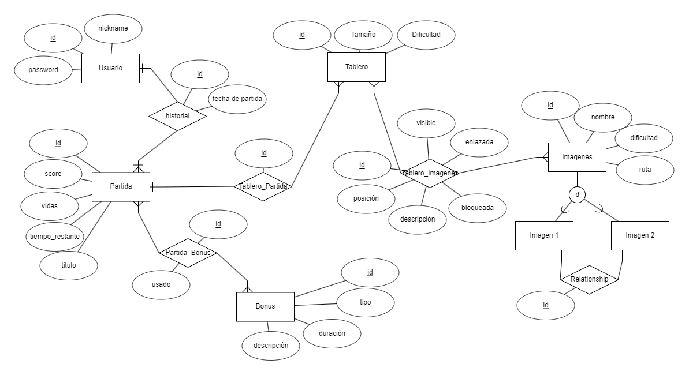

<p align="center">
  
    <h1 align="center">Tecnología y Aplicaciones Web: Entrega 2</h1>
    <h1 align="center">Grupo Mamba-Mentality</h1>
</p>

# Integrantes

| Nombre                     | Email                  | Github                                                   |
| -------------------------- | ---------------------- | -------------------------------------------------------- |
| Gerardo Castro :red_car:  | gicastro@uc.cl  | [@GerardoICF](https://github.com/GerardoICF)               |
| Nicolás Herrera :smile: | nhi1016@uc.cl   | [@nhi1016 ](https://github.com/nhi1016)        |

## Para instalar el proyecto se debe ejecutar
```console
yarn install
```
, por lo que se debe tener instalado `node` y ``yarn`` previamente

El cual instalará los siguientes paquetes:
+ `dotenv`
+ `koa`
+ `koa-body`
+ `koa-cors2`
+ `koa-logger`
+ `koa-router`
+ `nodemon`
+ `eslint`
+ `bcrypt`
+ `Knex`
+ `pg`

# Instrucciones para levantar el servidos
1. Definir la variable de entorno `PORT` en el archivo `.env`, por ejemplo (`PORT=3000`)

# Instrucciones para levantar la Base de Datos
1. Es necesario crear las variables de entorno en el archivo `.env` en el directorio `/`
2. Tener instalado `postgres`
2. Se deben definir las variables `DB_HOST`, `DB_NAME`, `DB_PASSWORD`, `DB_USER` en el archivo `.env`
3. Crear la Base de Datos de:
    + Nombre = ``DB_NAME``
    + Usuario de postgres = ``DB_USER``
    + Password de usuario = `DB_PASSWORD`
    + `DB_HOST` = `localhost`
    + Se puede seguir el siguiente orden
    ```console
    sudo service postgresql start
    sudo -u postgres psql

    %% Dentro de la consola de postgres

    CREATE USER DB_USER WITH PASSWORD DB_PASSWORD;
    ALTER USER DB_USER WITH SUPERUSER;
    CREATE DATABASE DB_NAME WITH OWNER DB_USER;
    ```
4. Con el comando ``yarn migrar_db`` se crea la DB necearia
5. Con el comando ``yarn seed_db`` se insertan datos para testear la DB
6. Con el comando ``desmigrar_db`` se borran las tablas de la DB

\* Notar que despues de migrar y desmigrar la conexión con la DB queda habierta durante unos 60 segundos aproximadamente. Para terminar esa espera se puede ejecutar el comando `yarn migrar_all` que agrupa los tres anteriores

## Consultas a la DDBB
Para otorgar seguridad al proyecto de `SQL injections` se decidió utilizar `Knex.js` como query builder en vez de un ORM como `Sequelize`, ya que nos permite modelar la DDBB y mantener un control sobre ella y sobre sus relaciones, además que el lenguaje de consulta es más intuitivo y parecido a ``SQL`` en consola

# La Base de Datos
Esta consiste en 5 entidades y 5 relaciones, las que se muestran como tablas a continuación:
1. Usuario
2. Partida
3. Historial
4. Tablero
5. Tablero_Partida
6. Imagen
7. Tablero_Imagenes
8. R_Im_Im
9. Bonus
10. Partida_Bonus



# End-Point's
La documentación se puede revisar en el siguiente link, el cual está escrito en postman, por lo que para tener una visión completa, se debe cambiar manualmente por los **Example Request**, los cuales muestran todos los casos posibles de un endpoint.

https://documenter.getpostman.com/view/27779437/2s93sW8FjL

## Puntos a considerar
+ Se usó Gitflow durante toda esta entrega
+ Se utilizó ESLint durante toda esta entrega para corregir errores y ajustar el estilo a "AirBNB"
+ Se agregó dinamismo a la vista de instrucciones del frontend, que quedó pendiente en la entrega pasada. Esta se puede ver en el *branch MAIN* del frontend luego de ejecutar `yarn vite`
+ Se avanzó en la vista del tablero en el repositorio del frontend, la cual se puede revisar en el *branch MAIN* luego de correr `yarn vite` en `http://localhost:5173/Board` del repositorio frontend
